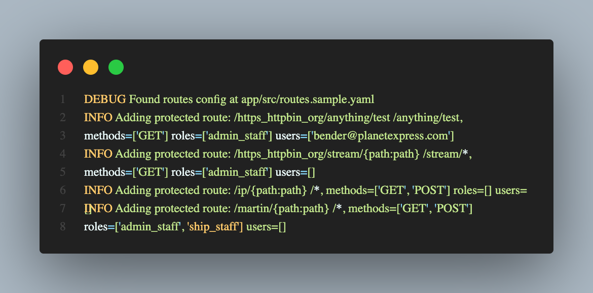
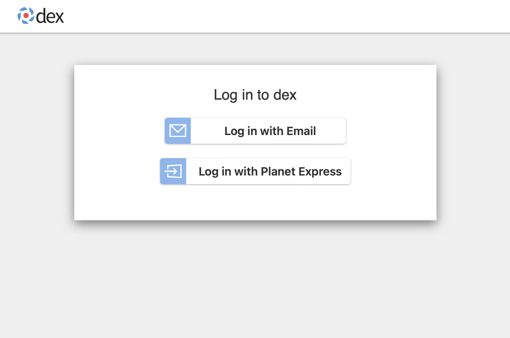

# FastAPI Gatekeeper

An OIDC proxy designed to sit in front of insecure services, intercept requests, authenticate with a third party IdP (e.g. Dex) and then authorise them. Heavily inspired by the original Keycloak Gatekeeper (now discontinued).

## Quick Start

Use the provided `docker-compose.yaml`. This will deploy a couple of test services.

```zsh
docker compose up
```

Now run the proxy with the sample environment variables set.

```zsh
GATEKEEPER_ENV=sample src/run.py
```

### Authentication

Navigate to a protected route. You'll be prompted to login with credentials before you're able to access that resource.

- [localhost:8000/proxy-endpoint/super-secret](http://localhost:8000/proxy-endpoint/super-secret) will give you transparently proxied information from a remote service.
- [localhost:8000/about/me](http://localhost:8000/about/me) will give you information about the currently logged in user.


- There is an "Email" login available with the credentials `admin@example.com` and `password`.
- Choose `Planet Express` to login with LDAP credentials for that organisation. The ldap server uses [docker-test-openldap](https://github.com/rroemhild/docker-test-openldap) with an existing pre-populated list of users and groups. For example, `professor@planetexpress.com` with password `professor`.

**Any logged in user can access these routes currently.**

### Authorisation

The [admins-only](http://localhost:8000/admins-only) endpoint requires that an individual is in the `admin_staff` group.

```py
@app.get("/admins-only")
    async def admin_endpoint(
        user: dict = Depends(get_current_user_group("admin_staff")),
    ):
        return {"message": "Welcome, admin!"}

    return app
```

If you attempt to navigate here as a user such as `bender@planetexpress.com` password `bender` you'll be presented with a `403` error.

> {"message":"Unauthorised. You shouldn't be here."}

Navigating with this user to [/about/me](http://localhost:8000/about/me) indicates this is because they're part of only the `ship_crew` group.

## Adding your own configuration

A commented [routes.sample.yaml](src/routes.sample.yaml) file is provided to get you started. Gatekeeper will read this and then automatically create routes that can be proxied securely using this.

This file contains a list of `upstreams` which represent all available backends we want to proxy to.

For each `upstream`:

- `url`: A mandatory attribute. Where we can find the root of the service in question.
- `slug` (optional): A url friendly name for the upstream. This is used as the path by FastAPI. So, for example, a slug of `ip` can be found at `http://localhost:8000/ip` (assuming localhost:8000 as your FastAPI application).
- `uris`: The individual resources that need protecting. Wildcards `*` are accepted and you can provide details as to the specific http verbs (`methods`) and the `roles` users need to have to access or specify individual `users` who are allowed to access regardless of role.

```yaml
# Configuration for Proxy Routing with Access Control

# The upstreams section lists all the remote services you want to proxy.
# Each upstream has its own set of URIs with associated access rules.
upstreams:
  # The 'url' is the address of the remote service you want to proxy to.
  # Optionally, you can provide a 'slug', which acts as a unique identifier for this upstream.
  # If you don't provide a 'slug', one will be auto-generated from the URL.
  - url: "https://httpbin.org"
    #slug: "first-service" # This is an optional identifier for your service.

    # Under 'uris', you define rules for specific paths of this upstream.
    # You specify the path, the HTTP methods, and the allowed roles/users.
    uris:
      "/anything/test": # Path you want to secure.
        methods: # HTTP methods this rule applies to. If omitted, all methods are allowed.
          - GET
        roles: # Roles that are allowed to access this path.
          - admin_staff
        users: # Specific users allowed. This has priority over roles.
          - bender@planetexpress.com

      "/stream/*": # You can use wildcards to cover multiple paths.
        methods:
          - GET
        roles:
          - admin_staff

  # Here's another upstream example with an explicit slug.
  - url: "https://ipleak.net"
    slug: "ip"
    uris:
      "/*": # This URI is open to any authenticated user, as neither 'roles' nor 'users' are specified.
        methods:
          - GET
          - POST

  - url: "http://localhost:3000"
    slug: "martin"
    uris:
      "/*": # This URI is open to any authenticated user, as neither 'roles' nor 'users' are specified.
        methods:
          - GET
          - POST
        roles:
          - admin_staff
          - ship_staff
# Make sure to always keep this configuration secure!
# Unauthorized access or changes to this configuration can compromise your service's security.
```

To test this out in practice we can run with the sample configuration.

```zsh
GATEKEEPER_ENV=sample \
GATEKEEPER_ROUTES=routes.sample.yaml \
src/run.py --reload
```

We've passed in the sample environment variables (`.env.sample`) and custom routes (`routes.sample.yaml`) here.

You'll see in the logs that gatekeeper has discovered the custom rules and inserted routes, with protection.



Let's take our `httpbin` upstream and test it.

```yaml
- url: "https://httpbin.org"
    uris:
      "/anything/test": # Path you want to secure.
        methods:
          - GET
        roles:
          - admin_staff
        users:
          - bender@planetexpress.com
```

As we haven't supplied a `slug` the application has automatically created one for us. It's not very catchy...

> Adding protected route: /https_httpbin_org/anything/test

So our upstream slug is `/https_httpbin_org` and we're protecting the uri `/anything/test`.

Security observations:

- It's a protected route, so FastAPI won't return anything unless we're a logged in user.
- We're allowing anyone in the `admin_staff` group to access this route.
- The user `bender@planetexpress.com` is allowed to use this route regardless of their group/role membership.

Using [http://localhost:8000/https_httpbin_org/anything/test](http://localhost:8000/https_httpbin_org/anything/test)

**Anonymous Access**
We're prompted for a login, FastAPI won't allow us to view it without being a user. ✅



**Unauthorised User**
Testing with an `Email` user `admin@example.com` should fail (as they're not a named user, nor part of the `admin_staff` group).

> {"message":"Unauthorised. You shouldn't be here."}

In the logs we see the below.

```
DEBUG    ROLE: admin@example.com not matched in route rules. Has [] but needs any of ['admin_staff'].
DEBUG    USER: admin@example.com not matched in route rules.
INFO     User admin@example.com not authorised for route.
DEBUG    Custom exception unauthorised 403 handler called.
```

**Authorised User (in Group)**
Attempting with a `Planet Express` login for `professor@planetexpress.com` and `professor` as the password shows you the correct information ✅.

The logs are as follows:

> DEBUG ROLE: professor@planetexpress.com matched in route rules. Has ['admin_staff'] and needs any of ['admin_staff'].
> DEBUG USER: professor@planetexpress.com not matched in route rules.
> INFO User professor@planetexpress.com authorised for route.
> DEBUG uri_rule: methods=['GET'] roles=['admin_staff'] users=['bender@planetexpress.com']
> DEBUG upstream_url: https://httpbin.org
> DEBUG Proxying for: /anything/test
> DEBUG https://httpbin.org/anything/test

**Authorised User (named user)**
Attempting with a `Planet Express` login for `bender@planetexpress.com` and `bender` as the password.

> DEBUG ROLE: bender@planetexpress.com not matched in route rules. Has ['ship_crew'] but needs any of ['admin_staff'].

So bender isn't allowed according to the group memberships they have.

> DEBUG USER: bender@planetexpress.com matched in route rules.
> INFO User bender@planetexpress.com authorised for route.

But they were matched on the named users criteria and therefore allowed to proceed.
