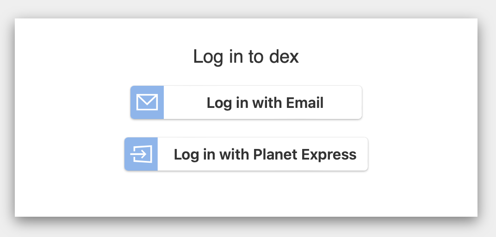

# FastAPI Gatekeeper

An OIDC proxy designed to sit in front of insecure services, intercept requests, authenticate with a third party IdP (e.g. Dex) and then authorise them.

## Quick Start

Use the provided `docker-compose.yaml`. This will deploy a couple of test services.

```zsh
docker compose up
```

Now run the proxy.

```zsh
src/run.py
```

Navigate to a protected route, eg. [localhost:8000/proxy-endpoint/super-secret](http://localhost:8000/proxy-endpoint/super-secret).

You'll be prompted to login with credentials before you're able to access that resource.



- There is an "Email" login available with the credentials `admin@example.com` and `password`.
- Choose `Planet Express` to login with LDAP credentials for that organisation. The ldap server uses [docker-test-openldap](https://github.com/darth-veitcher/docker-test-openldap) with an existing pre-populated list of users and groups. For example, `professor@planetexpress.com` with password `professor`.
